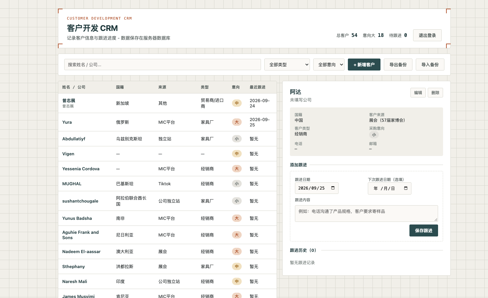

# WMCRM

外贸客户管理系统（服务器版）。Node.js + Express + SQLite，浏览器访问，支持简单的密码登录、客户信息与跟进记录管理。



## 功能

- 客户档案：姓名、公司、国籍、来源、类型、电话、邮箱、采购意向
- 跟进记录：每次可添加跟进内容、跟进日期、下次跟进日期，可删除单条记录
- 搜索 / 筛选（类型、意向）/ 待跟进统计
- JSON 导出备份 / 导入备份（支持合并导入或清空后恢复）
- 共用密码登录，会话 30 天有效

## Docker 部署（推荐）

```bash
docker build -t wmcrm .

docker run -d --name wmcrm \
  -p 3000:3000 \
  -v wmcrm-data:/app/data \
  -e CRM_PASSWORD=你的登录密码 \
  --restart unless-stopped \
  wmcrm
```

浏览器打开 `http://服务器IP:3000`，输入 `CRM_PASSWORD` 设置的密码登录。

数据库文件在 `wmcrm-data` 卷内，重建/升级容器不丢数据。

### 升级

```bash
docker pull 或重新 docker build 后：
docker stop wmcrm && docker rm wmcrm
docker run ...  # 命令同上，数据卷保留
```

## 配置项（环境变量）

| 变量 | 必填 | 默认值 | 说明 |
|---|---|---|---|
| `CRM_PASSWORD` | 是 | - | 登录密码 |
| `PORT` | 否 | 3000 | 监听端口 |
| `COOKIE_SECURE` | 否 | false | 经过 Nginx 配置 HTTPS 后建议设为 `true` |
| `DATA_DIR` | 否 | ./data | 数据库文件目录 |

## 建议：Nginx + HTTPS

生产环境建议用 Nginx 反向代理并配置 HTTPS 证书（如 certbot），同时设置 `COOKIE_SECURE=true`：

```nginx
location / {
    proxy_pass http://127.0.0.1:3000;
    proxy_set_header Host $host;
    proxy_set_header X-Real-IP $remote_addr;
    proxy_set_header X-Forwarded-For $proxy_add_x_forwarded_for;
    proxy_set_header X-Forwarded-Proto $scheme;
}
```

## 非 Docker 运行

需 Node.js 22+：

```bash
npm ci --omit=dev
CRM_PASSWORD=你的密码 node server.js
```

## 数据备份

- 页面上"导出备份"可随时下载全量 JSON
- 或直接备份 SQLite 数据库文件（`data/crm.db`）

恢复时点页面上"导入备份"选择备份 JSON：

- **合并导入**：按 ID 更新已存在的客户、加入新客户，不删除现有数据，重复导入同一文件不会产生重复数据
- **清空后导入**：先删除全部现有客户和跟进记录，再用备份完整替换（恢复备份用这个）
